Final Project Complete – MashBish Multi-Chat Messenger (Client/Server + JavaFX)

• Server fully implemented using Java Sockets (listens, accepts clients, broadcasts messages)
• Client fully implemented with JavaFX (TextArea, TextField, Send Button)
• Client connects to server and sends/receives messages correctly
• Multi-client chat supported (server broadcasts to all clients)
• Threading added for handling multiple clients and UI responsiveness
• Error handling and clean shutdown added
• Code documented and organized in /client and /server packages
• JavaFX configured and runs successfully with VM options
• Completed full 10-day commit plan with incremental progress
• README created with instructions + architecture overview + screenshots
• Added GroupEval.docx to repository

Project meets all final assignment requirements.
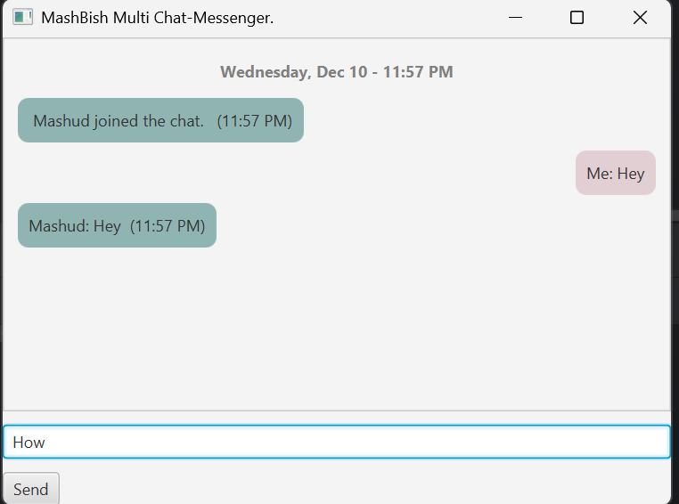
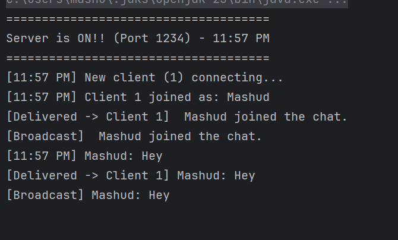

______________________________________________________________________________________________
______________________________________________________________________________________________
Day - 9
- Clean message input interaction
- Improve Chat UI Bubble Layout
- updated server to support multiple clients and message delivery
- Improve more on log side areas.

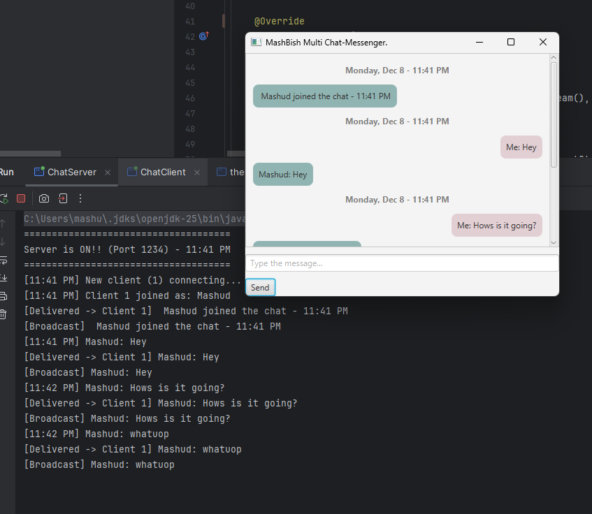

Day - 8
- Added a centered date/time banner at the start of every chat session
- Implemented real-time messaging for multiple users
- Added timestamp display for each outgoing and incoming message
- Improved chat display to make the UI feel more functional and modern
- Cleaned up structure and layout for better readability and future upgrades

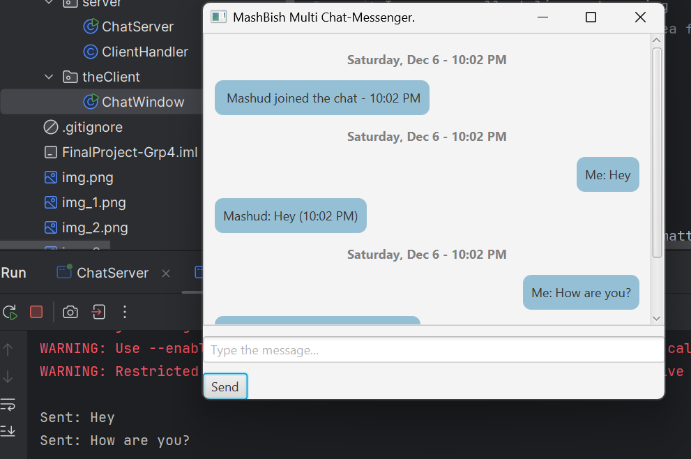
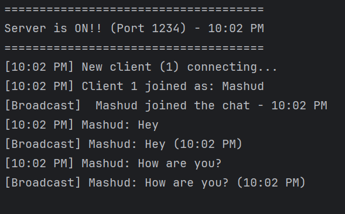

Day - 7
Updated chatwindow UI.
Add timestamp to each message
Add “user joined/left” UI message formatting
Improve scroll styling and spacing

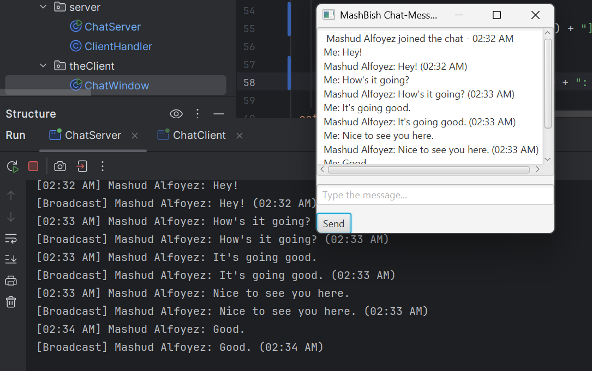

______________________________________________________________________________________________
______________________________________________________________________________________________

Day - 6
Today's we had great progress on the project.
- Develop and Added when client disconnected system should detect and print, 
- add broadest system message
- Worked on auto scroll the chat window
- Added username box on the startup before pops up the main chat screen
- user will enter their name or stay anynoumus.
- updated more on UI layout.

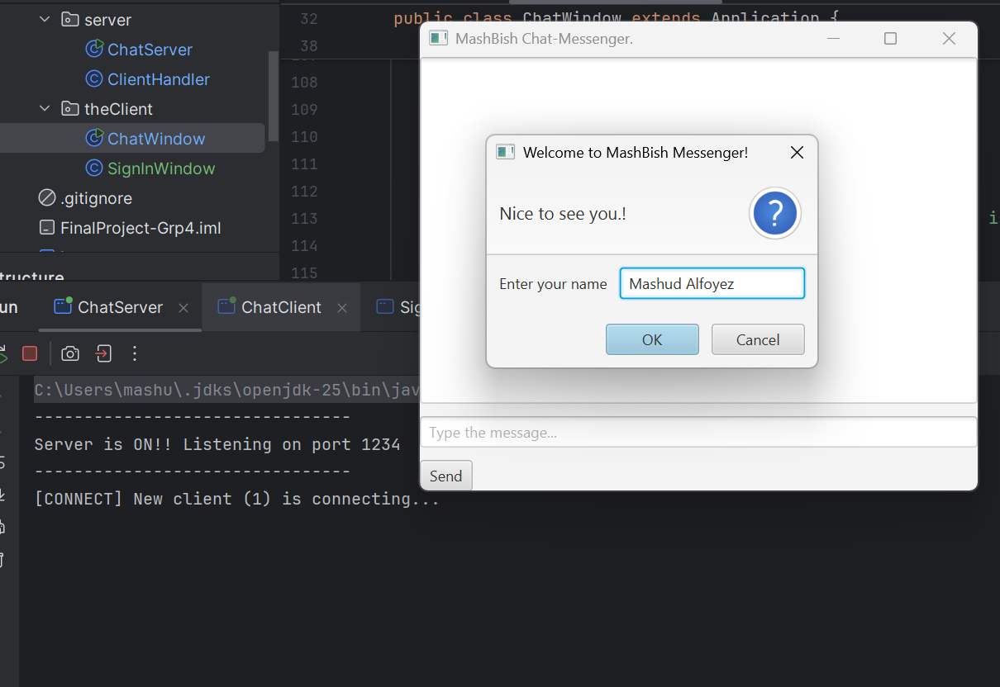
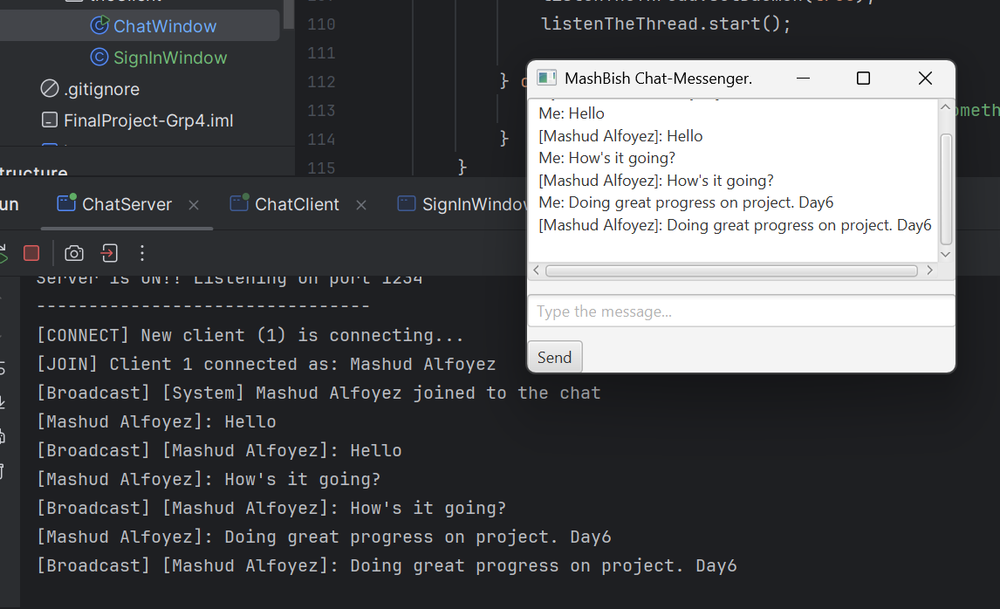
______________________________________________________________________________________________
______________________________________________________________________________________________

Day -5 
Today- we worked on added:
- Listen for message from server added thread and update UI layout
- Updated the ClientHandler to read all incoming message
- then print them to show on the console and also forward them to -
- all clients server by adding client ID tracking.

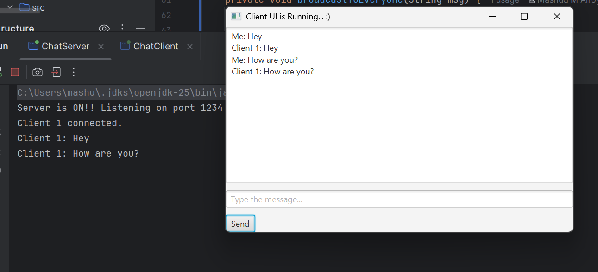
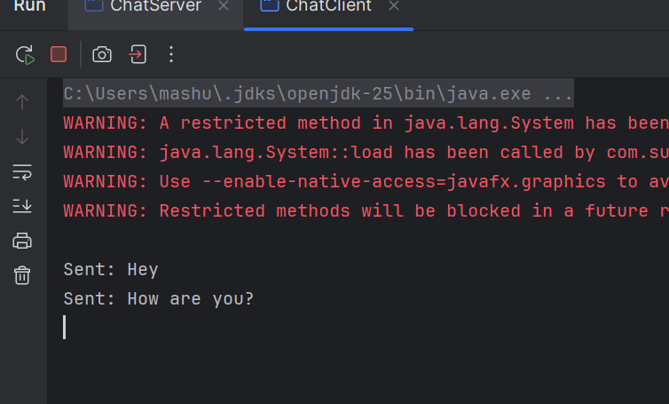
______________________________________________________________________________________________
______________________________________________________________________________________________

Day-4
We worked on updating more on server and client.
1. Added client to the ChatServer, and store each connection.
2. Add more update on the chatWindow UI  layout.
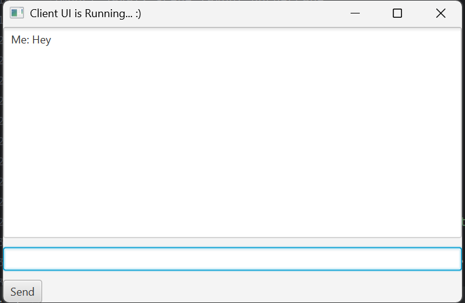
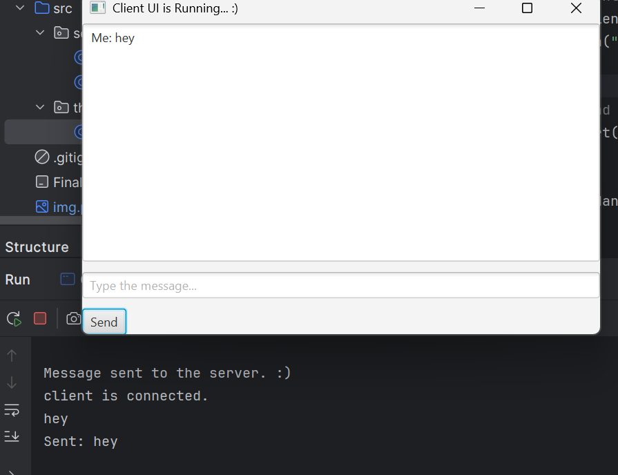

______________________________________________________________________________________________
______________________________________________________________________________________________

Day - 3 Added basic UI layout to client (TextArea, TextField, Send button).
Messages now print locally and send to server.

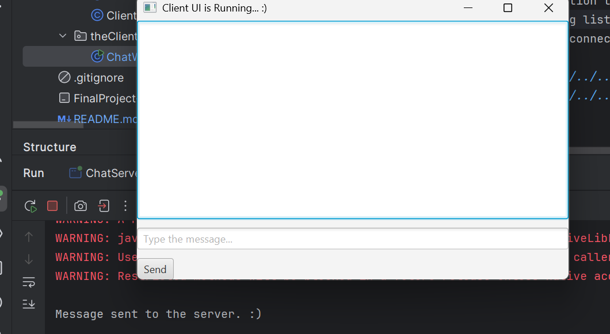

______________________________________________________________________________________________
______________________________________________________________________________________________

Day-2 Server loop added and client connection tested.
- We update the ChatServer to keep getting listen for incoming client connection using while loop.
- Added each message to console for each connection.

______________________________________________________________________________________________
______________________________________________________________________________________________

Day - 1 Project Setup, JavaFX setup, very basic client and server View created.

IntelliJ project created for CIS-296 Final Project
JavaFX SDK added and VM options configured
Connected client and server package created with their class component.
Basic server program which will (prints “Server ON”)
Simple client program which will (connects to server)
JavaFX window launches successfully. :)

